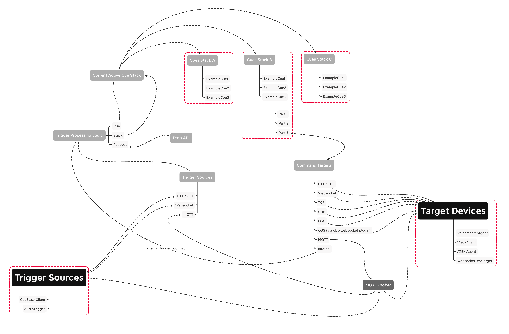

# CueStack

## Intro to CueStack
Inspired by an old tool called Cue Composer, this project seeks to provide a middle component as part of a whole production coordination system. 
The stack system is intended to allow you to build out multiple versions of the same cues, with the stack representing overall context. 
External triggers will call cues by name, but what those cues actually DO is dependent on which stack is currently active. 

As an example, imagine you are doing a live theatre performance in an outdoor venue, with some performances during daytime, and others at night. Your lighting cues will need to be different during the day, but much of the other elements may remain the same. 
The entire performance is timecoded, with the sound board triggering other elements via OSC. You can build two cue stacks which represent "Daytime" and "Night" performances, and nothing needs to be changed in terms of what messages the sound board is sending.

Another example, you are hosting a quiz show with four participants, on a web stream. You are streaming to Twitch via OBS Studio. You might have a trigger which calls to OBS in order to highlight the participant whos turn it is. You could prepare four cue stacks where that highlight becomes progressively more pronounced, and trigger them from a countdown timer.
 


## Vocabulary
    
* Cue - a set of commands, called Parts, to execute when a trigger calls this cue by name
* Part - a single command to send
* Cue Stack - a set of cues representing a specific state of the production
* Trigger - an external stimulus calling a cue by name
* Trigger Source = the thing sending a trigger, you can have many of these
* Command - something to trigger, like sending a websocket command to OBS
* Command Target - the thing receiving a command, you can have many of these

## Limitations

* A Cue represents an instantanious situation, it does not include any timing information. All timing should be handled by whatever is receiving the command. This is an intentional design decision, as it allows CueStack to run as fast as possible without any consideration for timing.
* Triggers are opaque; you cannot pass along information with them
* commands are sent to targets one way only; though we may use an API capable of returning data, we make no use of it.


## Conceptual Diagram



## Config
Configuration is stored in a single file: `config-cuestack.json`. It contains four top-level keys: `default_stack`, `stacks`, `trigger_sources`, and `command_targets`. Here is an example:
```json
{
  "default_stack": "StackA",
  "stacks": [
    {
      "name": "StackA",
      "cues": [
        {
          "name": "winter_ball",
          "parts": [
            {
              "target": "tcp-example",
              "command": {
                "message": "i am the walrus"
              }
            }
          ]
        }
      ]
    },
    {
      "name": "StackB",
      "cues": [
        {
          "name": "winter_ball",
          "parts": [
            {
              "target": "tcp-example",
              "command": {
                "message": "i am NOT the walrus"
              }
            }
          ]
        }
      ]
    }
  ],
  "command_targets": [
    {
      "enabled": false,
      "name": "tcp-example",
      "type": "tcp-generic",
      "config": {
        "host": "localhost",
        "port": 8103
      }
    },
    {
      ...
    }
  ],
  "trigger_sources": [
    {
      "enabled": true,
      "name": "GenericWebsocket1",
      "type": "websocket",
      "config": {
        "port": 8081
      }
    }
  ]
}
```

## Trigger Sources

Trigger sources must send a JSON formatted string. The available keys are:
* `cue` call a cue
* `stack` change the current stack
* `request` request data about cues or stacks

A trigger source may send a message with one or more of these keys, but only one of each; stack change command will be executed before the cue trigger.
The `request` key allows you to ask for `cues` `stacks` or `currentStack`, and the corresponding data will be returned in the `result` key as shown below.

The client will receive a response in the form of a JSON formatted string with two possible keys:
* `status` either "OK" or description of the error encountered
* `result` the result of a request, if one was made

The `status` key will reflect the result of processing `cue` or `stack`, and will only reflect an error in handling request if it threw an unexpected exception.
Remember that `stack` is tracking; you only need to specify a stack when you want to change it.
### Websocket
Trigger sources should connect to the port specified, and send messages in the form:
`{"cue": "my_cue_name", "stack": "StackA", "request": "cues"}`

Config:
```json
    {
      "enabled": true,
      "name": "GenericWebsocket1",
      "type": "websocket",
      "config": {
        "port": 8081
      }
    }
```

### HTTP GET

HTTP GET actually does not use JSON encoding, instead encoding the keys in the url like this: `http://localhost:8081/trigger?cue=my_cue_name&stack=StackA&request=cues`
The response body will be JSON encoded.

```json
    {
      "enabled": true,
      "name": "GenericHTTP",
      "type": "http",
      "config": {
        "port": 8080
      }
    }
```

### MQTT

Messages are sent as JSON encoded string, exactly like websocket, but there will be no response (good or bad), it is all sent blindly. As a result, you cannot use the MQTT trigger source for making data requests.
```json
    {
      "enabled": false,
      "name": "GenericMQTT",
      "type": "mqtt",
      "config": {
        "host": "james-broker",
        "port": 1883,
        "topic": "CueStackTrigger"
      }
    }
```

## Command Targets
There are many more command target options, and the list will continue to grow

### OBS Studio via obs-websocket plugin

You can use any request documented [here](https://github.com/Elektordi/obs-websocket-py/blob/master/obswebsocket/requests.py), the `request` key must match one of those classes, and the `args` key is where you must include any arguments as listed in `:Arguments:` within that class definition.
CueStack can only send messages to OBS Studio, it cannot fetch information; responses are ignored, except for errors.
#### Cue part
```json
            {
              "target": "obs",
              "command": {
                "request": "SetSourceFilterVisibility",
                "args": {
                  "sourceName": "Player2",
                  "filterName": "expanded",
                  "filterEnabled": true
                }
              }
            },
            {
              "target": "obs",
              "command": {
                "request": "SetCurrentScene",
                "args": {
                  "scene_name": "WinterBall_Daytime_2source"
                }
              }
            }
```

#### Config
```json
    {
      "enabled": false,
      "name": "obs",
      "type": "obs-websocket",
      "config": {
        "host": "localhost",
        "port": 4444,
        "password": "secret"
      }
    }
```

### Generic OSC
As a handy shortcut, you can omit the `value` key, and a value of `1` will be sent

#### Cue Part
```json
            {
              "target": "qlcplus",
              "command": {
                "address": "/button/1"
              }
            },
            {
              "target": "qlcplus",
              "command": {
                "address": "/slider/22",
                "value": 132
              }
            }
```

#### Config
```json
    {
      "enabled": true,
      "name": "qlcplus",
      "type": "osc-generic",
      "config": {
        "host": "127.0.0.1",
        "port": 7703
      }
    }
```

### Generic UDP
#### Cue Part
```json
            {
              "target": "udp-example",
              "command": {
                "message": "{\"msg\": \"hello\"}"
              }
            }
```
You can also send a message as a dict, to avoid having to escape quotes with a slash. The dict will be converted into a json-encoded string before sending:
```json
            {
              "target": "udp-example",
              "command": {
                "message_type": "dict",
                "message": {
                  "msg": "hello"
                }
              }
            }
```
#### Config
```json
    {
      "enabled": false,
      "name": "udp-example",
      "type": "udp-generic",
      "config": {
        "host": "localhost",
        "port": 9191
      }
    }
```

### Generic TCP
#### Cue Part
```json
            {
              "target": "tcp-example",
              "command": {
                "message": "{\"msg\": \"hello\"}"
              }
            }
```
You can also send a message as a dict, to avoid having to escape quotes with a slash. The dict will be converted into a json-encoded string before sending:
```json
            {
              "target": "tcp-example",
              "command": {
                "message_type": "dict",
                "message": {
                  "msg": "hello"
                }
              }
            }
```
#### Config
```json
    {
      "enabled": false,
      "name": "tcp-example",
      "type": "tcp-generic",
      "config": {
        "host": "localhost",
        "port": 8103
      }
    }
```

### HTTP GET
#### Cue Part
```json
            {
              "target": "http-example",
              "command": {
                "message": "/someendpoint?param1=foo&param2=bar"
              }
            }
```
You can also send a message as a dict. The path and params will be converted into an appropriate url before sending:
```json
            {
              "target": "http-example",
              "command": {
                "message_type": "dict",
                "message": {
                  "path": "someendpoint",
                  "params": {
                    "param1": "foo",
                    "param2": "bar"
                  }
                }
              }
            }
```

#### Config
```json
    {
      "enabled": false,
      "name": "http-example",
      "type": "http-generic",
      "config": {
        "host": "localhost",
        "port": 9090
      }
    }
```

### Generic Websocket
#### Cue Part
```json
            {
              "target": "websocket-example",
              "command": {
                "message": "{\"msg\": \"hello\"}"
              }
            }
```

You can also send a message as a dict, to avoid having to escape quotes with a slash. The dict will be converted into a json-encoded string before sending:
```json
            {
              "target": "websocket-example",
              "command": {
                "message_type": "dict",
                "message": {
                  "msg": "hello"
                }
              }
            }
```

#### Config
```json
    {
      "enabled": false,
      "name": "websocket-example",
      "type": "websocket-generic",
      "config": {
        "host": "localhost",
        "port": 8113
      }
    }
```

### MQTT
#### Cue Part
```json
            {
              "target": "mqtt-example",
              "command": {
                "topic": "testtopic",
                "message": "{\"msg\": \"hello\"}"
              }
            }
```

You can also send a message as a dict, to avoid having to escape quotes with a slash. The dict will be converted into a json-encoded string before sending:

```json
            {
              "target": "mqtt-example",
              "command": {
                "topic": "testtopic",
                "message_type": "dict",
                "message": {
                  "msg": "hello"
                }
              }
            }
```

#### Config
```json
    {
      "enabled": false,
      "name": "mqtt-example",
      "type": "mqtt-generic",
      "config": {
        "host": "192.168.1.202",
        "port": 1883
      }
    }
```

## Voicemeeter Agent
The Voicemeeter Agent is designed to allow you to remotely control a Voicemeeter instance on a remote machine, using websocket messages.
You can use the generic websocket command target to send messages to this agent. The agent supports control messages using the same input modules as CueStack, so it also supports HTTP Get and MQTT messages for control.

You can send messages that will use the `apply` method as documented [here](https://github.com/chvolkmann/voicemeeter-remote-python).
You may notice that API supports other methods, but we have chosen to only use `apply` as it covers everything in one call.

Voicemeeter Agent has its own config file, which is pretty straightforward:
```json
{
  "voicemeeter_kind": "potato",
  "command_sources": [
    {
      "enabled": true,
      "name": "GenericWebsocket1",
      "type": "websocket",
      "config": {
        "port": 9901
      }
    },
    {
      "enabled": false,
      "name": "GenericHTTP",
      "type": "http",
      "config": {
        "port": 9902
      }
    },
    {
      "enabled": false,
      "name": "GenericMQTT",
      "type": "mqtt",
      "config": {
        "host": "james-broker",
        "port": 1883,
        "topic": "VoicemeeterAgent"
      }
    }
  ]
}
```

And a cue part looks like this:
```json
            {
              "target": "voicemeeter",
              "command": {
                "message": "{\"apply\": {\"in-0\": {\"mute\": false}}}"
              }
            }
```

You can also send a message as a dict, to avoid having to escape quotes with a slash. The dict will be converted into a json-encoded string before sending. As you can see in the below example. more complex control messages are much easier when you dont have to mind your quotes!:

```json
            {
              "target": "voicemeeter",
              "command": {
                "message_type": "dict",
                "message": {
                  "apply": {
                    "in-0": {
                      "mute": false,
                      "A1": true,
                      "A2": true,
                      "A3": false,
                      "gain": -6.0
                    },
                    "in-1": {
                      "A1": false,
                      "A2": false,
                      "A3": true,
                      "gain": 1.2
                    }
                  }
                }
              }
            }
```